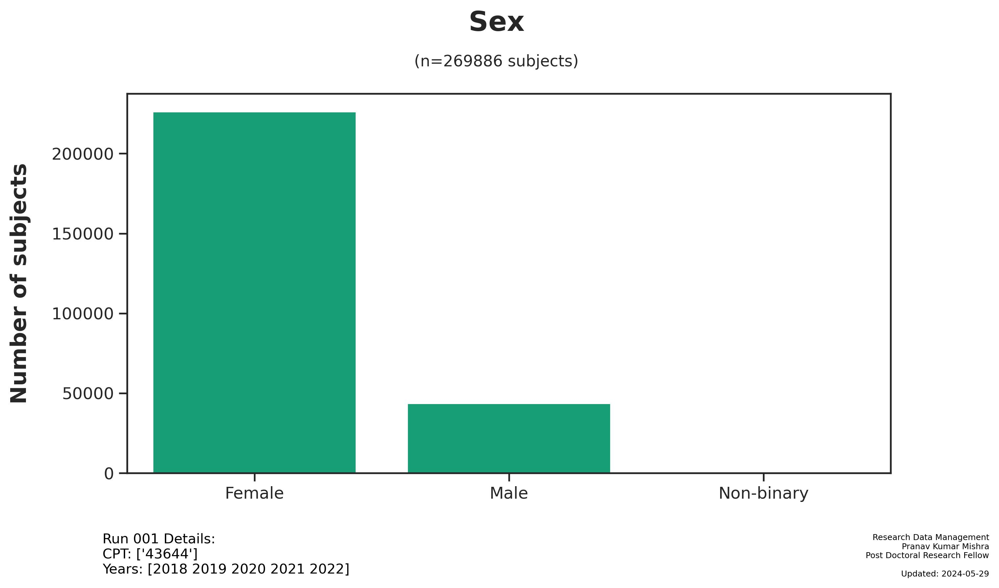
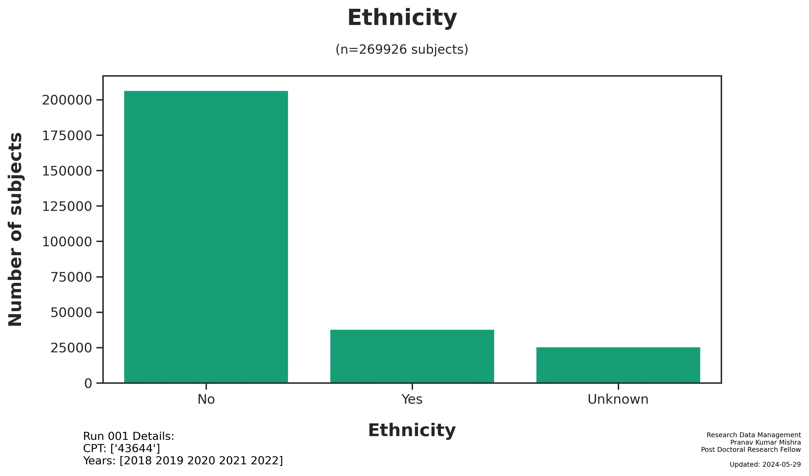
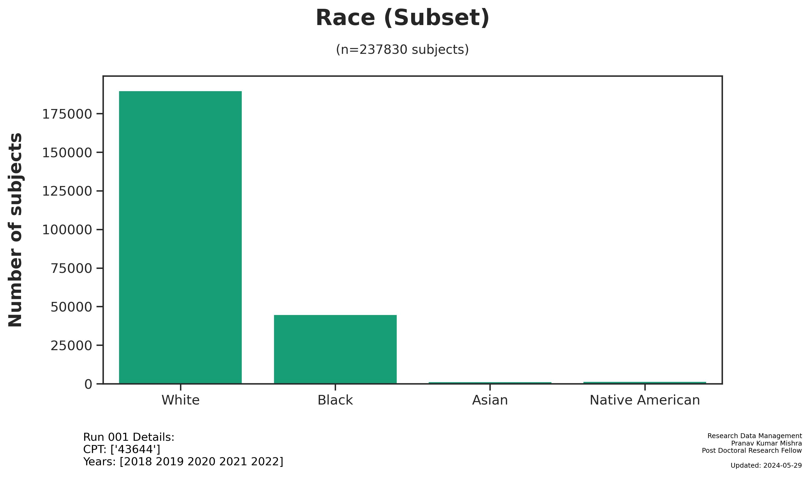
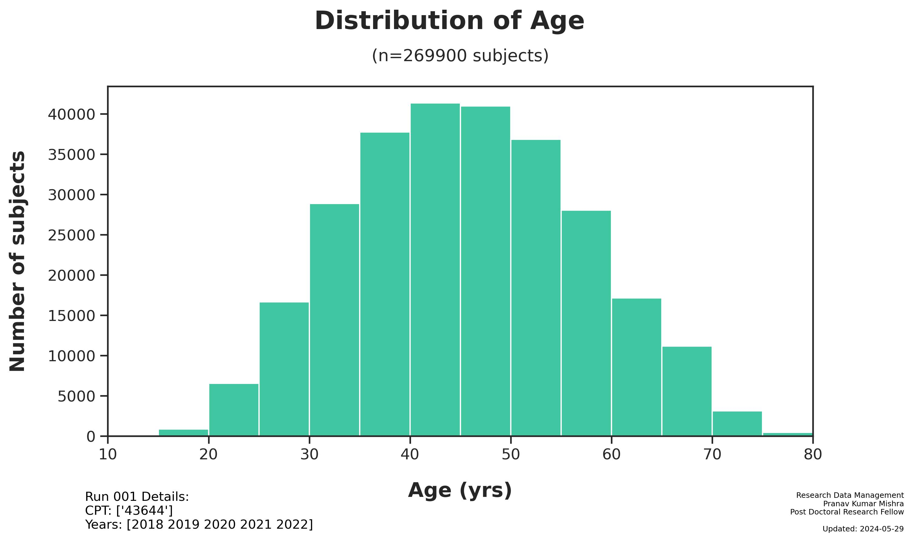
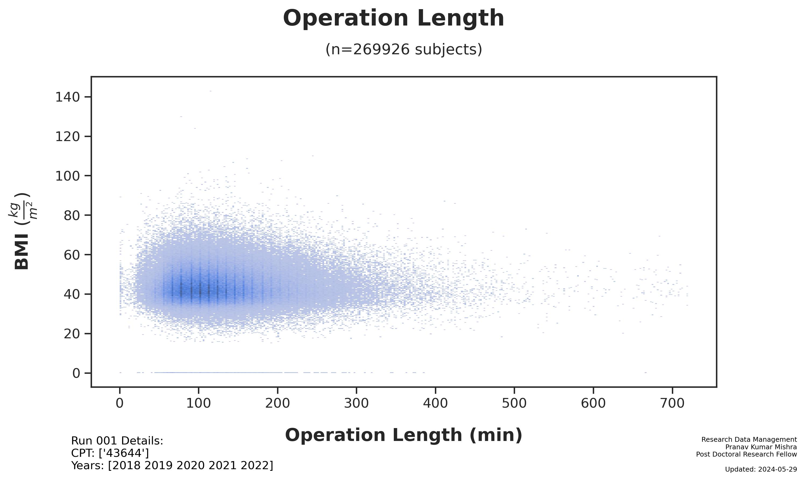

---  
title: Run 001 Summary
subtitle: "An analysis of the MBSA-QIP Dataset"  
date: last-modified  
date-format: full  
author:  
  - name:  
      given: Pranav Kumar  
      family: Mishra  
    affiliations:  
      - ref: rushsurg  
      - ref: rushortho  
    corresponding: true  
    url: https://drpranavmishra.com  
    email: pranav_k_mishra@rush.edu  
    orcid: 0000-0001-5219-6269    
    role: "Post Doctoral Research Fellow"  
format:  
  html:  
    code-fold: true  
  gfm:
    preview-mode: raw  
  pdf:  
    documentclass: scrartcl  
    toc-depth: 3  
    code-fold: true  
    highlight-style: github  
    colorlinks: true  
    tbl-cap-location: bottom  
---

# Run 001 Summary

Generated: 2024-05-29

## Run Parameters:

- CPT Codes: `['43644']`
- Year Start: `2021`
- Year Stop: `2022`

## Dataset

- Subjects: `269,926`
- [Main Dataset Parquet](data/analysis/bariatric/runs/run_001/tables/Run001_main_dataset.parquet)
- [Demo CSV - Random 20 Subjects](data/analysis/bariatric/runs/run_001/tables/Run001_demo_selected.csv)

## Figures

## Files

The following files were generated from Run 001:

- readme.md
- readme.html
- readme-gfm.md
- readme.pdf
- figures/demographics/Run001_Demographics-Donor_Sex.jpg
- figures/demographics/Run001_Demographics-Ethnicity.jpg
- figures/demographics/Run001_Demographics-Race.jpg
- figures/demographics/Run001_Demographics_Age_at_Surgery.jpg
- figures/surgery/Run001_Sx-OPLENGTH_PREVSURG.jpg
- notebooks/Run001_analysis.ipynb
- notebooks/Run001_analysis.html
- notebooks/Run001_analysis.tex
- notebooks/Run001_analysis.aux
- notebooks/Run001_analysis.toc
- notebooks/Run001_analysis.log
- notebooks/Run001_analysis_files/figure-html/cell-14-output-1.png
- notebooks/Run001_analysis_files/figure-html/cell-15-output-2.png
- notebooks/Run001_analysis_files/figure-html/cell-16-output-2.png
- notebooks/Run001_analysis_files/figure-html/cell-17-output-2.png
- notebooks/Run001_analysis_files/figure-html/cell-18-output-2.png
- notebooks/Run001_analysis_files/figure-pdf/cell-14-output-1.png
- notebooks/Run001_analysis_files/figure-pdf/cell-15-output-2.png
- notebooks/Run001_analysis_files/figure-pdf/cell-16-output-2.png
- notebooks/Run001_analysis_files/figure-pdf/cell-17-output-2.png
- notebooks/Run001_analysis_files/figure-pdf/cell-18-output-2.png
- tables/Run001_demo_selected.csv
- tables/Run001_main_dataset.parquet

