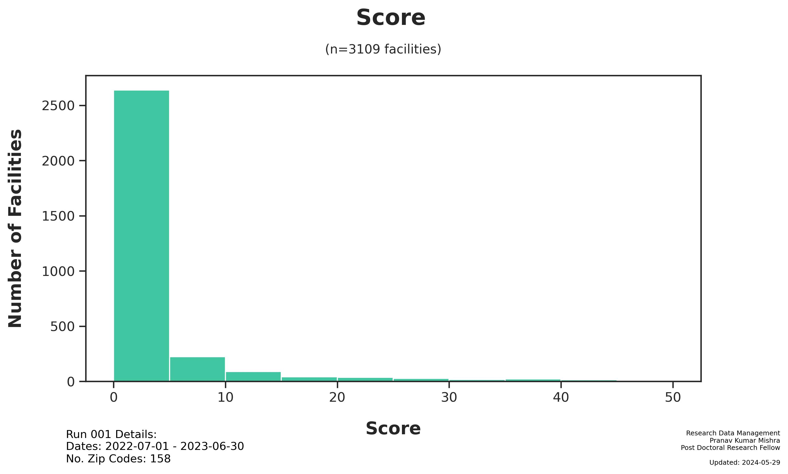
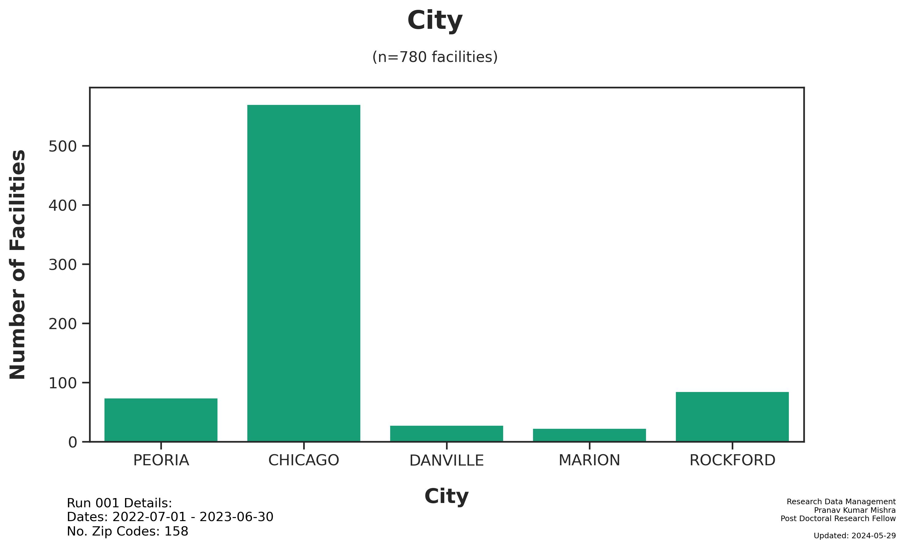

---  
title: Run 001 Summary
subtitle: "An analysis of the MBSA-QIP Dataset"  
date: last-modified  
date-format: full  
author:  
  - name:  
      given: Pranav Kumar  
      family: Mishra  
    affiliations:  
      - ref: rushsurg  
      - ref: rushortho  
    corresponding: true  
    url: https://drpranavmishra.com  
    email: pranav_k_mishra@rush.edu  
    orcid: 0000-0001-5219-6269    
    role: "Post Doctoral Research Fellow"  
format:  
  html:  
    code-fold: true  
  pdf:  
    documentclass: scrartcl  
    toc-depth: 3  
    code-fold: true  
    highlight-style: github  
    colorlinks: true  
    tbl-cap-location: bottom  
  gfm:  
    preview-mode: raw  
---

# Run 001 Summary

Generated: 2024-05-29

## Run Parameters:

- Zip Codes: `60002 - 62999`

## Dataset

- Subjects: `5,496`
- [Main Dataset Parquet](data/analysis/timely_effective/runs/run_001/tables/Run001_main_dataset.parquet)
- [Demo CSV - Random 20 Subjects](data/analysis/timely_effective/runs/run_001/tables/Run001_demo_selected.csv)

## Figures

## Files

The following files were generated from Run 001:

- notebooks/Run001_analysis.ipynb
- figures/Run001_TE_Score_Dist.jpg
- figures/Run001_TE_City Count.jpg
- tables/Run001_main_dataset.parquet
- tables/Run001_demo_selected.csv

