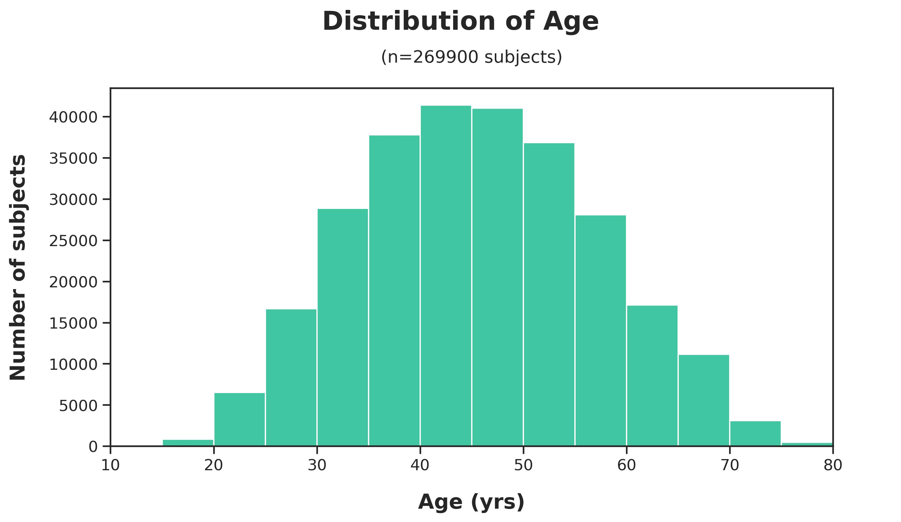
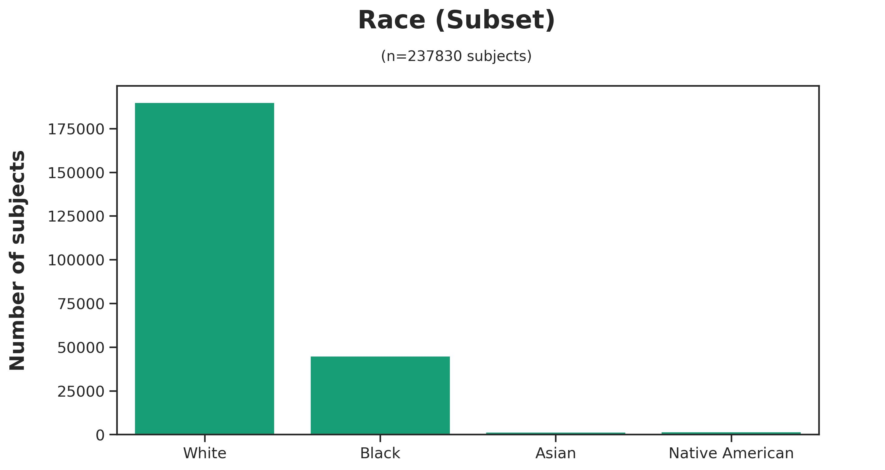
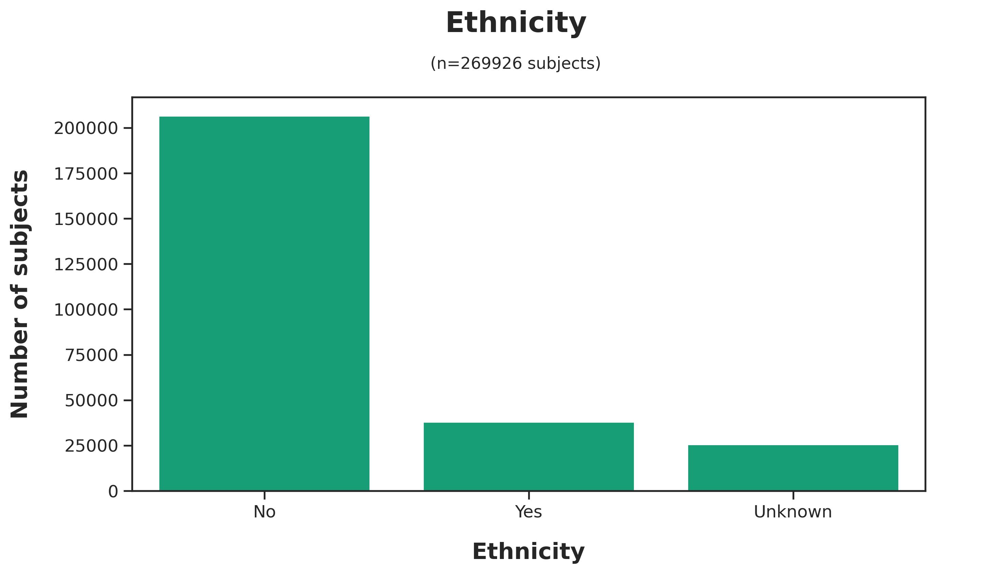

# Run 001 Summary
Pranav Kumar Mishra
Wednesday, May 29, 2024

# Run 001 Summary

Generated: 2024-05-29

## Run Parameters:

- CPT Codes: `['43644']`
- Year Start: `2021`
- Year Stop: `2022`

## Dataset

- Subjects: `269,926`
- [Main Dataset
  Parquet](data/analysis/bariatric/runs/run_001/tables/Run001_main_dataset.parquet)
- [Demo CSV - Random 20
  Subjects](data/analysis/bariatric/runs/run_001/tables/Run001_demo_selected.csv)

## Figures

## Files

The following files were generated from Run 001:

- Run001.json
- readme.md
- figures/demographics/Run001_Demographics_Age_at_Surgery.jpg
- figures/demographics/Run001_Demographics-Donor_Sex.jpg
- figures/demographics/Run001_Demographics-Race.jpg
- figures/demographics/Run001_Demographics-Ethnicity.jpg
- figures/surgery/Run001_Sx-OPLENGTH_PREVSURG.jpg
- tables/Run001_main_dataset.parquet
- tables/Run001_demo_selected.csv
- notebooks/Run001_analysis.ipynb
- text/Run001.parameters
- text/Run001.json
