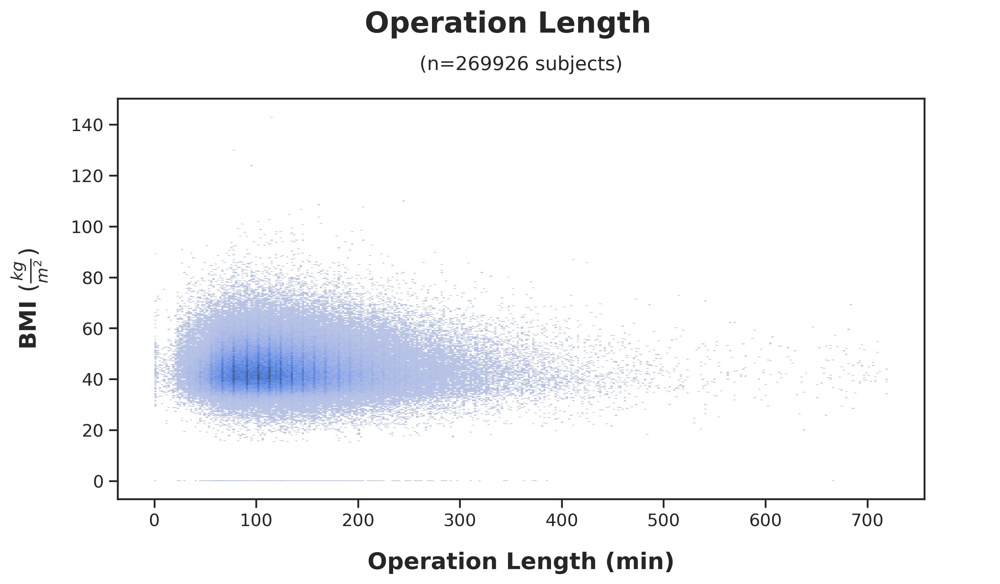

# Run 002 Summary
Pranav Kumar Mishra
Wednesday, May 29, 2024

# Run 002 Summary

Generated: 2024-05-29

## Run Parameters:

- CPT Codes: `['43644', '43755']`
- Year Start: `2021`
- Year Stop: `2022`

## Dataset

- Subjects: `269,926`
- [Main Dataset
  Parquet](data/analysis/bariatric/runs/run_002/tables/Run002_main_dataset.parquet)
- [Demo CSV - Random 20
  Subjects](data/analysis/bariatric/runs/run_002/tables/Run002_demo_selected.csv)

## Figures

## Files

The following files were generated from Run 002:

- readme.md
- readme.html
- readme-gfm.md
- readme.pdf
- figures/demographics/Run002_Demographics-Donor_Sex.jpg
- figures/demographics/Run002_Demographics-Ethnicity.jpg
- figures/demographics/Run002_Demographics-Race.jpg
- figures/demographics/Run002_Demographics_Age_at_Surgery.jpg
- figures/surgery/Run002_Sx-OPLENGTH_PREVSURG.jpg
- notebooks/Run002_analysis.ipynb
- notebooks/Run002_analysis.html
- notebooks/Run002_analysis.pdf
- tables/Run002_demo_selected.csv
- tables/Run002_main_dataset.parquet
