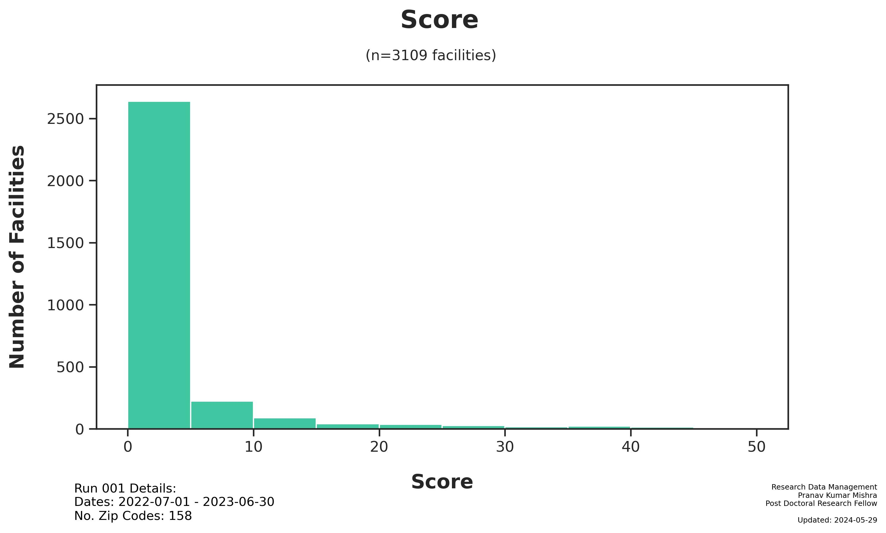

# Run 001 Summary
Pranav Kumar Mishra
Wednesday, May 29, 2024

# Run 001 Summary

Generated: 2024-05-29

## Run Parameters:

- Zip Codes: `60002 - 62999`

## Dataset

- Subjects: `5,496`
- [Main Dataset
  Parquet](data/analysis/timely_effective/runs/run_001/tables/Run001_main_dataset.parquet)
- [Demo CSV - Random 20
  Subjects](data/analysis/timely_effective/runs/run_001/tables/Run001_demo_selected.csv)

## Figures

## Files

The following files were generated from Run 001:

- notebooks/Run001_analysis.ipynb
- figures/Run001_TE_Score_Dist.jpg
- figures/Run001_TE_City Count.jpg
- tables/Run001_main_dataset.parquet
- tables/Run001_demo_selected.csv
