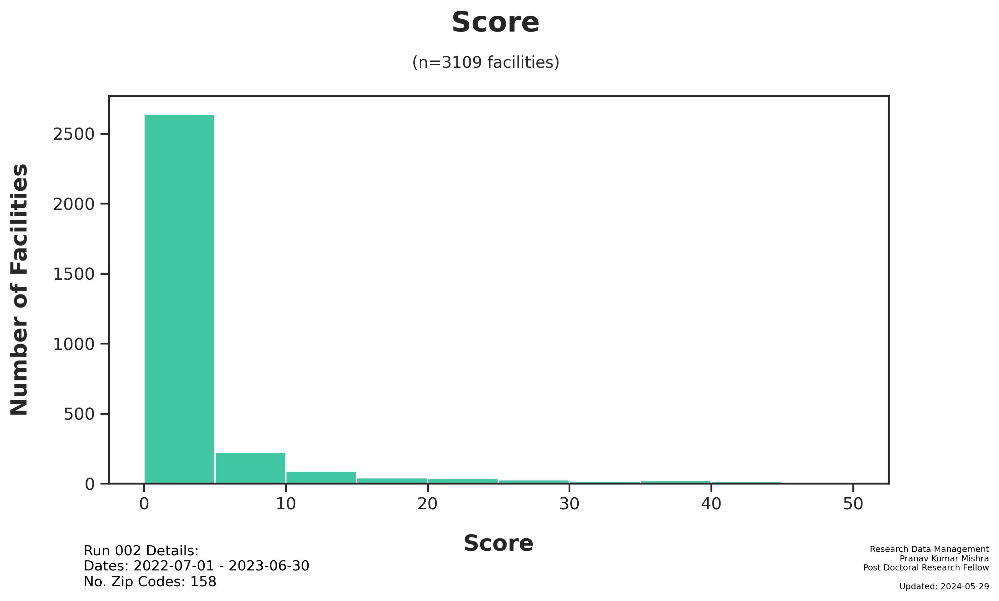

# Run 002 Summary
Pranav Kumar Mishra
Wednesday, May 29, 2024

# Run 002 Summary

Generated: 2024-05-29

## Run Parameters:

- Zip Codes: `60000 - 70001`

## Dataset

- Subjects: `5,496`
- [Main Dataset
  Parquet](data/analysis/timely_effective/runs/run_002/tables/Run002_main_dataset.parquet)
- [Demo CSV - Random 20
  Subjects](data/analysis/timely_effective/runs/run_002/tables/Run002_demo_selected.csv)

## Figures

## Files

The following files were generated from Run 002:

- notebooks/Run002_analysis.ipynb
- figures/Run002_TE_Score_Dist.jpg
- figures/Run002_TE_City Count.jpg
- tables/Run002_main_dataset.parquet
- tables/Run002_demo_selected.csv
