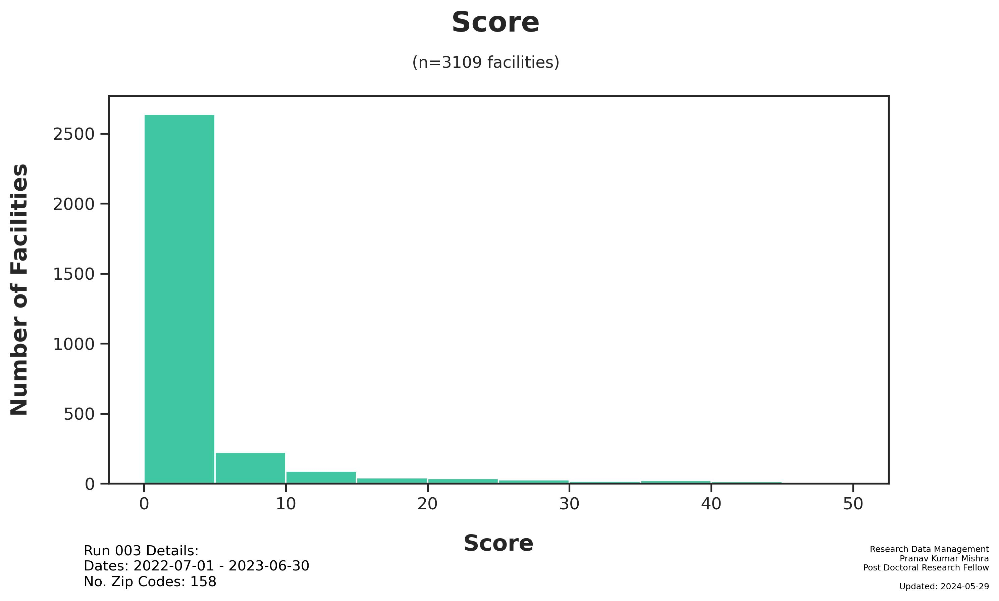

# Run 003 Summary
Pranav Kumar Mishra
Wednesday, May 29, 2024

# Run 003 Summary

Generated: 2024-05-29

## Run Parameters:

- Zip Codes: `0 - 99999`

## Dataset

- Subjects: `5,496`
- [Main Dataset
  Parquet](data/analysis/timely_effective/runs/run_003/tables/Run003_main_dataset.parquet)
- [Demo CSV - Random 20
  Subjects](data/analysis/timely_effective/runs/run_003/tables/Run003_demo_selected.csv)

## Figures

## Files

The following files were generated from Run 003:

- notebooks/Run003_analysis.ipynb
- figures/Run003_TE_Score_Dist.jpg
- figures/Run003_TE_City Count.jpg
- tables/Run003_main_dataset.parquet
- tables/Run003_demo_selected.csv
